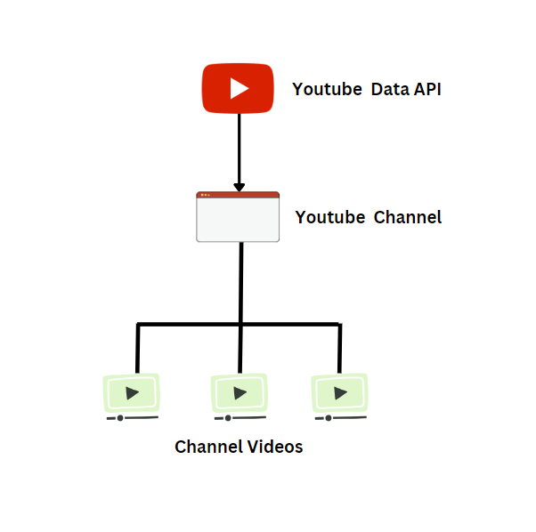

# YouTube API Project

A project that assessess youtube Data using the YOUTUBE Data API, a particular youtube channel is picked for the purpose of this project based on the `channelID` of the channel, and information regarding the channel statistics is derived using URL's provided on the youtube API site. The workflow for the project is visualize below.

### Getting Channel ID
to understand this process click this [link:]("https://www.youtube.com/watch?v=zNABOcxGkt8")

* The statistics about the youtube is first derived using the following url snippet ---> `https://www.googleapis.com/youtube/v3/channels?part=statistics&id={self.channel_id}&key={self.api_key}`

* The link that contains paginated information regarding each video on the youtube channel can be accessed using the following link: `https://www.googleapis.com/youtube/v3/search?key={self.api_key}&channelId={self.channel_id}&part=id&order=date`.
The current page contain the token for the next page which can be used to access the content for the next page.

### Video Data

The video data was obtained using 3 attributes which are `statistics`, `contentDetails`, `snippet`, the following attributes were put in a list and looped to get information for each attributes using the following link: `https://www.googleapis.com/youtube/v3/videos?part={part}&id={video_id}&key={self.api_key}`.

* snippet

 

* statistics

 

* contentDetail

